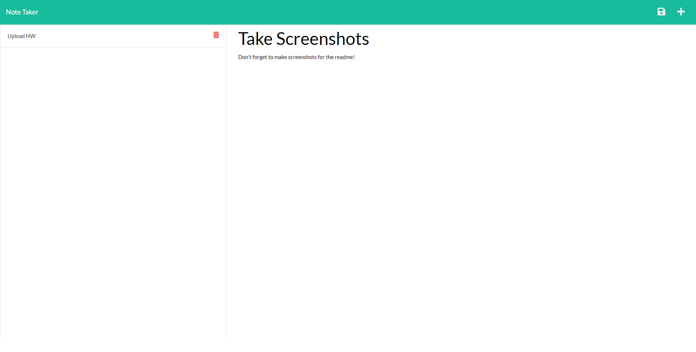
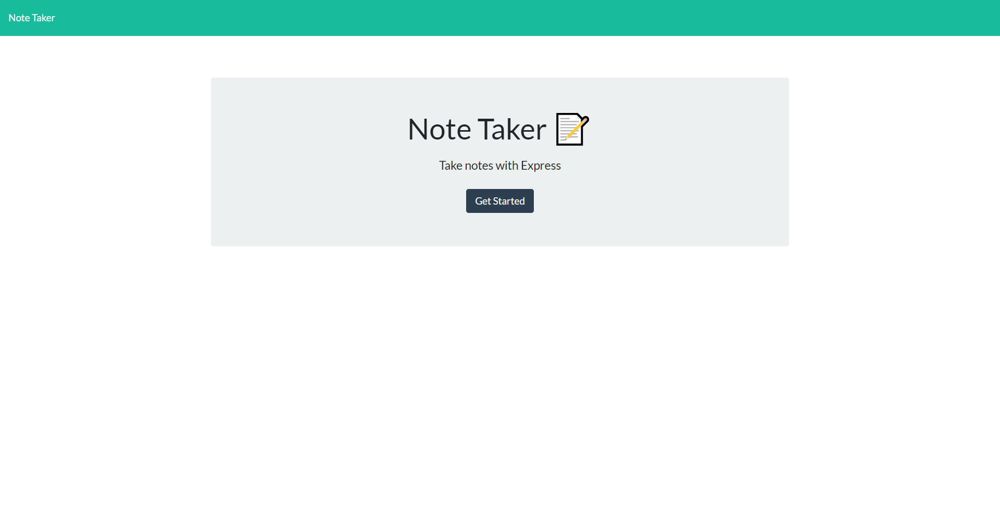

# notorious-notes

Deployed link: https://sleepy-stream-81333.herokuapp.com/

Repo link: https://github.com/curriecoder/notorious-notes

## Description

This app allows the user to input notes into the text fields with a title and save them to a database. If the user would like to delete the note, there is a button next to the note that will delete it. The motivation for this project was to work with middleware and server side languages in order to develop an understanding of how to communicate through a stack. I learned how to create a back end for an app and how to use heroku to host the app.

## Usage

To use this app, follow the link above for the deployed program. Click on 'Get Started' to go to the note page. Write a title for a new note and some text content, and then click the save icon to save it to the left column. You can delete any note by clicking the trashcan icon next to that note.
    
    
## Credits

I would first like to thank the instructors of UPenn LPS Coding Bootcamp class of 08-2021 for continually putting the students at the top of the importance list. Also, huge thanks to all of the students in class for always collaborating in the slack channel!

## License
Copyright 2021 Andrew Currie

Permission is hereby granted, free of charge, to any person obtaining a copy of this software and associated documentation files (the "Software"), to deal in the Software without restriction, including without limitation the rights to use, copy, modify, merge, publish, distribute, sublicense, and/or sell copies of the Software, and to permit persons to whom the Software is furnished to do so, subject to the following conditions:

The above copyright notice and this permission notice shall be included in all copies or substantial portions of the Software.

THE SOFTWARE IS PROVIDED "AS IS", WITHOUT WARRANTY OF ANY KIND, EXPRESS OR IMPLIED, INCLUDING BUT NOT LIMITED TO THE WARRANTIES OF MERCHANTABILITY, FITNESS FOR A PARTICULAR PURPOSE AND NONINFRINGEMENT. IN NO EVENT SHALL THE AUTHORS OR COPYRIGHT HOLDERS BE LIABLE FOR ANY CLAIM, DAMAGES OR OTHER LIABILITY, WHETHER IN AN ACTION OF CONTRACT, TORT OR OTHERWISE, ARISING FROM, OUT OF OR IN CONNECTION WITH THE SOFTWARE OR THE USE OR OTHER DEALINGS IN THE SOFTWARE.
--------------------------------------------------------------